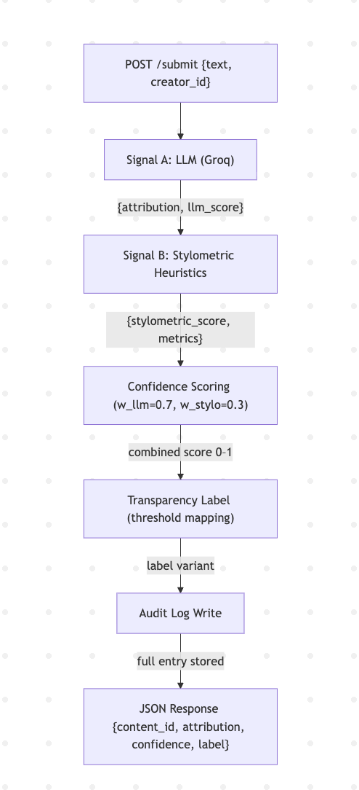
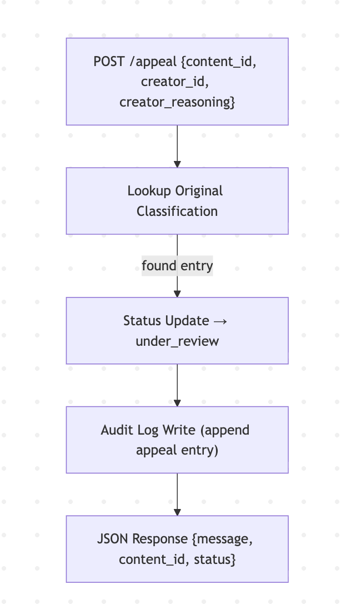

# Provenance Guard — Planning Document

This document is the main plan for my project. It outlines the decisions I made before starting implementation so I have a clear roadmap while building the system. I'll also use this as the reference when prompting AI tools throughout the project.

---

# 1. System Overview

The goal of Provenance Guard is to classify submitted text using two different detection methods. The results from both methods are combined into a single confidence score that tells users whether the content is likely AI-generated, likely human-written, or too uncertain to determine.

The system also keeps an audit log of every classification, allows users to appeal decisions, and includes rate limiting to help prevent abuse.

### Main API Endpoints

**POST `/submit`**

* Accepts:

  ```json
  { "text": "...", "creator_id": "123" }
  ```
* Returns:

  ```json
  {
    "content_id": "...",
    "attribution": "...",
    "confidence": 0.82,
    "label": "High-confidence AI"
  }
  ```

**POST `/appeal`**

* Accepts:

  ```json
  {
    "content_id": "...",
    "creator_id": "...",
    "creator_reasoning": "..."
  }
  ```
* Updates the content status to `under_review`.

**GET `/log`**

* Returns the most recent audit log entries in JSON format.

---

## Architecture

### Submission Flow



### Appeal Flow



---

# 2. Detection Signals

The classifier uses two independent signals.

## Signal A — LLM Detection (Groq)

This signal looks at the writing itself and tries to determine whether it appears AI-generated based on semantic and stylistic patterns.

It returns:

```json
{
  "attribution": "likely_ai | likely_human | uncertain",
  "llm_score": 0.81
}
```

The prompt sent to Groq should:

* return JSON only
* include a short explanation whenever confidence is low

**Blind spots:** This signal struggles with lightly edited AI text — if a human rewrites a few sentences of AI output, the LLM may classify the whole piece as human-written. It can also be inconsistent across runs since it relies on probabilistic model output.

---

## Signal B — Stylometric Analysis

The second signal measures characteristics of the writing itself, including:

* vocabulary diversity
* average sentence length
* token-to-type ratio
* punctuation density

It returns:

```json
{
  "stylometric_score": 0.63,
  "metrics": { ... }
}
```

**Blind spots:** Formal human writing (academic papers, legal text) often has uniform sentence structure and high vocabulary consistency, which looks AI-like to these heuristics. Conversely, creative or intentionally chaotic AI output may score as human. This signal also needs sufficient text length to be reliable — very short submissions produce noisy metrics.

---

## Testing

I'll test the classifier with at least four different examples:

* clearly AI-generated text
* clearly human-written text
* an edited AI example
* a borderline case

This will help verify how each signal behaves individually and how they work together.

---

# 3. Confidence Score

Since both signals produce values between 0 and 1, they can be combined into one final confidence score.

The formula is:

```python
confidence = w_llm * llm_score + w_stylo * stylometric_score
```

Default weights:

* LLM signal = **0.7**
* Stylometric signal = **0.3**

Current thresholds:

* **0.75 or higher** → High-confidence AI
* **0.40–0.74** → Uncertain
* **Below 0.40** → High-confidence Human

During Milestone 4, I'll test these thresholds with several examples and adjust them if needed.

---

# 4. Transparency Labels

The system displays one of three messages after classification.

### High-confidence AI

> High-confidence AI: Our system has high confidence this piece was generated by AI. If you believe this is incorrect, you may submit an appeal for human review.

### Uncertain

> Uncertain: The system could not confidently determine whether this was written by AI or a human. A human review may help resolve this.

### High-confidence Human

> High-confidence human: Our system has high confidence this piece was written by a human. If you believe this is incorrect, you may still appeal.

These exact messages will also be used in the README and production responses.

---

# 5. Appeals Workflow

Users can challenge a classification by submitting an appeal.

The request includes:

```json
{
  "content_id": "...",
  "creator_id": "...",
  "creator_reasoning": "..."
}
```

When an appeal is received, the system will:

* change the status to `under_review`
* save the user's reasoning
* add a new audit log entry
* return a confirmation message

### Edge Cases

* Appeals for older content are still allowed in the demo.
* The system does not automatically reclassify submissions.
* Multiple appeals should each create their own audit log entry while preserving the original classification.

---

# 6. Audit Log

Every classification should create a structured audit log entry.

Each entry includes:

* timestamp
* content ID
* creator ID
* attribution
* confidence score
* raw signal outputs
* transparency label
* status

Optional fields include:

* appeal reasoning
* rate limit hit

For simplicity, the log can be stored as either a JSONL file or a SQLite database.

The `GET /log` endpoint will return the latest entries for easy testing and grading.

---

# 7. Rate Limiting

For the demo, users will be limited to:

**10 submissions per minute per IP address**

This should be enough for normal testing while preventing spam or repeated abuse.

I'll also include evidence of a `429 Too Many Requests` response in the README.

---

# 8. Expected Edge Cases

Some situations may produce less reliable classifications.

### Very Short Text

If a submission is extremely short (less than about 30 characters), both detection methods may have very little information to work with.

### Edited AI Writing

If AI-generated text has been heavily edited by a person, the LLM detector might classify it as human while the stylometric signal still detects AI-like writing patterns.

These situations are good candidates for manual review through the appeals process.

---

# 9. AI Tool Plan

## Milestone 3

I'll provide:

* this planning document
* the architecture diagram
* the LLM detection specification

I'll ask the AI to generate:

* a Flask project skeleton
* the `/submit` endpoint
* an `llm_signal()` function
* placeholder audit log support

I'll verify that everything matches the expected API and test it with a sample submission.

---

## Milestone 4

I'll provide the sections describing the detection signals and confidence scoring.

The AI should generate:

* `stylometric_signal(text)`
* `combine_scores()`
* unit tests
* at least four test examples

---

## Milestone 5

I'll provide:

* transparency labels
* appeals workflow
* audit log schema
* rate limiting requirements

The AI should generate:

* the `/appeal` endpoint
* the `/log` endpoint
* label mapping logic
* a simple rate limit test script

Every AI-generated file will be reviewed before being added to the project. I'll check for input validation, security issues (such as exposed API keys), and consistent logging.

---

# 10. Final Checklist

Before submitting the project, I'll verify that:

* `/submit` returns the expected JSON response.
* Both detection signals run successfully.
* Raw signal outputs are saved in the audit log.
* Different test cases produce noticeably different confidence scores.
* The transparency labels match the wording in this document and the README.
* `/appeal` updates the status and stores the user's reasoning.
* `/log` returns multiple structured audit entries.
* Rate limiting returns a **429** response when the limit is exceeded.

---

This planning document serves as the project's source of truth. It captures the design decisions made before implementation and will guide both development and AI-assisted code generation throughout the project.
